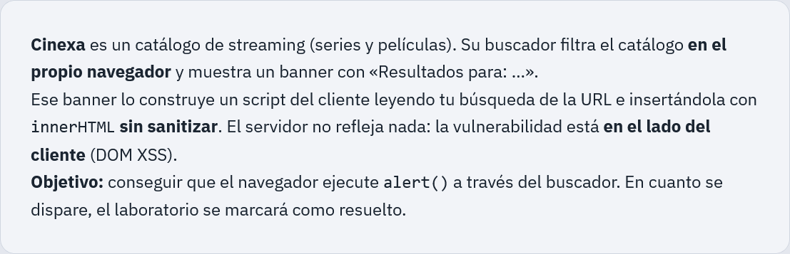
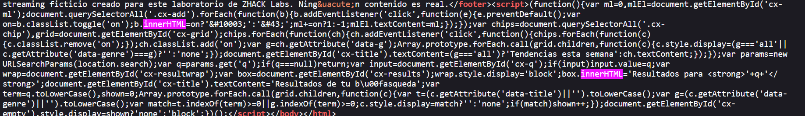

**Laboratorio:** [DOM XSS en el buscador del catálogo Cinexa](https://labs.zh4ck.es/lab/xss-dom-cinexa) — ZHACK Labs
**Categoría:** Cross-Site Scripting (XSS) — DOM-based
**Objetivo:** conseguir que el navegador ejecute `alert()` a través del parámetro `q` del buscador.

---
## 1. Enunciado


---
## 1. Descripción del laboratorio

Cinexa es un catálogo de streaming ficticio, del estilo Netflix pero de mentira, pensado solo para practicar. Tiene un buscador que filtra series y películas sin recargar la página: todo el filtrado pasa en el navegador, en JavaScript puro, sin llamadas al servidor.

La pista del enunciado ya adelanta bastante: el buscador lee tu búsqueda de la URL y la mete en un banner que dice "Resultados para: …". Esa frase la construye un script del cliente, y el enunciado avisa de que no hay ninguna sanitización de por medio. El servidor, en ningún momento, refleja nada, así que no estamos ante un XSS reflejado clásico. La vulnerabilidad vive entera en el navegador: es un DOM XSS.

Antes de tocar nada, se abren las herramientas de desarrollador y se mira el código HTML de la web para entender qué pasaba exactamente cuando se escribía algo en el buscador.

---
## 2. Análisis del código fuente

Buscando en el JavaScript de la página se encuentra el bloque que se encarga de mostrar los resultados de la búsqueda (casi al final):

```javascript
var params = new URLSearchParams(location.search);
var q = params.get('q');
if (q === null) return;
var input = document.getElementById('cx-q');
if (input) input.value = q;
var wrap = document.getElementById('cx-resultwrap');
var box = document.getElementById('cx-results');
wrap.style.display = 'block';
box.innerHTML = 'Resultados para <strong>' + q + '</strong>';
```


Aquí ya se ve el problema entero en una sola línea:

```javascript
box.innerHTML = 'Resultados para <strong>' + q + '</strong>';
```

Lo que pasa, paso a paso, es lo siguiente:

- `q` sale de `location.search`, es decir, de la URL. Esto es lo que en el mundo del pentesting se llama la **fuente** (source): un dato que el atacante controla por completo, porque es él quien escribe la URL.
- Ese valor se concatena, tal cual, dentro de una cadena que luego se asigna a `box.innerHTML`. Aquí está el **sumidero** (sink): `innerHTML` no trata el contenido como texto plano, lo trata como HTML de verdad. Si le metes una etiqueta, el navegador la crea como nodo del DOM.
- No hay ningún tipo de escape de caracteres especiales (`<`, `>`, comillas, etc.), ni tampoco se usa `textContent` o `innerText`, que son las alternativas seguras para este mismo caso.

En resumen: fuente controlada por el usuario, sumidero peligroso, cero sanitización en medio. Ese es literalmente el molde de un DOM XSS, y es justo lo que hace que este tipo de vulnerabilidad sea tan distinta de un XSS reflejado normal: aquí el servidor puede estar perfectamente bien escrito y hacer todo el escaping que quiera en sus respuestas, porque el problema nunca pasa por él. Todo el daño se hace en el JavaScript que ya está corriendo en el navegador de la víctima.

## 3. Explotación

### Payload que funciona

```html

```

Metido en el parámetro `q` de la URL de la instancia:

```
https://labs.zh4ck.es/i/21004f38028447a8b95ee069875ef647/?q=
```


También se prueba escribiéndolo directamente en el campo de búsqueda de la página, y funciona igual, porque el input alimenta la misma URL y el mismo código se ejecuta al leer `location.search`.


**Por qué funciona:**

1. El script coge `q` de la URL sin decodificar nada raro ni filtrar caracteres.
2. Al asignarlo con `innerHTML`, el navegador no ve un simple string, ve una cadena que hay que parsear como HTML. Ahí es donde entra en juego el algoritmo de parseo de fragmentos HTML del navegador.
3. `` es una etiqueta que se puede insertar en casi cualquier contexto de contenido HTML normal, así que se crea sin ningún problema como nodo hijo de `box`.
4. El atributo `src=x` apunta a un recurso que evidentemente no existe (una imagen llamada literalmente "x"). El navegador intenta descargarla, falla, y dispara automáticamente el evento `onerror` de ese elemento ``.
5. Dentro de `onerror` está el código `alert(1)`, que el navegador ejecuta como JavaScript normal y corriente. En cuanto se ejecuta ese `alert()`, el laboratorio lo detecta y marca el reto como resuelto.

Este payload es que no depende de que el navegador ejecute directamente una etiqueta `<script>` (cosa que, no pasa cuando se inserta HTML vía `innerHTML`: los navegadores modernos crean el nodo `<script>` pero no lo ejecutan, precisamente como medida de seguridad heredada de hace años). En cambio, aquí se usa un truco mucho más fiable: aprovechar un evento que el propio navegador dispara solo, como consecuencia de un error de carga totalmente normal y esperable.

### Payloads probados que no funcionaron


Antes de llegar al de ``, se probaron un par de alternativas típicas. Ninguna de las dos funcionó, y merece la pena explicar por qué, porque los motivos son distintos entre sí.

```html
<svg onload=alert(1)>
```

No se disparó el `alert()`. Este payload suele funcionar en muchos contextos de XSS, pero aquí no. La explicación más probable tiene que ver con cómo se comporta el evento `onload` de un elemento SVG cuando ese elemento se crea de forma dinámica, insertado a través de `innerHTML`, en vez de estar presente desde que el navegador parsea la página por primera vez. Cuando un `<svg>` ya forma parte del documento desde el principio, su `onload` se dispara de forma predecible en cuanto termina de cargar (o casi al instante, si no tiene recursos externos que cargar). Pero al insertarlo dinámicamente dentro de un `<div>` normal del namespace HTML, el comportamiento de ese evento varía según el motor de renderizado y el momento exacto en que se evalúa el árbol del DOM. En la práctica, para muchos navegadores modernos ese `onload` simplemente no llega a dispararse en este escenario concreto, mientras que el fallo de carga de una imagen inexistente sí es un evento mucho más determinista y garantizado.

```html
<body onload=alert(1)>
```

Este directamente no tiene ninguna oportunidad de funcionar, y la razón es de libro de reglas de parseo HTML: un documento solo puede tener un único `<body>`, y ya existe desde que se carga la página. Cuando el navegador procesa la cadena `'<body onload=alert(1)></body>'` como fragmento HTML para meterla dentro de otro nodo (en este caso, dentro de `box`, que es un `<div>`), el propio algoritmo de parseo descarta la etiqueta `<body>` porque no es válida como hijo de otro elemento del documento. No es que el navegador bloquee el evento por seguridad, es que la etiqueta ni siquiera llega a crearse como nodo, así que el atributo `onload` nunca existe de verdad en el DOM. El payload queda, básicamente, ignorado sin más.

Si el primer payload hubiese estado bloqueado por algún tipo de filtro (cosa que no pasó aquí, pero es buena práctica pensarlo), otras variantes que suelen funcionar en el mismo tipo de sumidero son cosas como `` para dejar constancia del dominio afectado, o directamente probar con otros eventos y etiquetas hasta encontrar uno que el filtro no contemple.

## 4. Impacto

Aquí el "ataque" se queda en un `alert()` con fines de práctica, pero merece la pena pararse un momento a pensar qué significaría esto en un sitio real. Si Cinexa fuera una aplicación de verdad y este bug llegase a producción, un atacante con este mismo payload (cambiando `alert(1)` por código bastante más interesante) podría, por ejemplo:

- Robar la cookie de sesión de la víctima, o cualquier token guardado en `localStorage` o `sessionStorage`, y con eso suplantar su sesión sin necesidad de contraseña.
- Ejecutar peticiones en nombre del usuario logueado, aprovechando que el JavaScript malicioso corre con los mismos permisos que el resto de la página.
- Redirigir silenciosamente a la víctima a una página de phishing que imite el login real.
- Modificar el contenido visible de la página para engañar al usuario de alguna forma, desde cambiar precios hasta simular mensajes falsos del sistema.

Y todo esto se consigue simplemente logrando que la víctima haga clic en un enlace con el payload metido en el parámetro `q`. No hace falta ningún acceso previo ni ninguna otra vulnerabilidad: basta con un link.

## 5. Conclusión

La vulnerabilidad está solo en el JavaScript que corre en el navegador, no en el servidor. Basta con usar `innerHTML` sobre un valor que viene de la URL, sin validar ni escapar nada, para que cualquiera pueda inyectar HTML arbitrario.


De los tres payloads que se probaron, solo uno funcionó, y no por casualidad: `` combina una etiqueta que se acepta en cualquier contexto de `innerHTML` con un evento que el propio navegador garantiza que se va a disparar en cuanto falla la carga de un recurso. Ni `<svg onload>` (que depende de un comportamiento poco predecible al insertarse dinámicamente) ni `<body onload>` (que ni siquiera llega a crearse como nodo por las reglas de parseo de HTML) consiguieron lo mismo. Al final, entender por qué fallan los payloads "erroneos" enseña casi tanto como el que funciona.

**Payload final:**

```html

```

**Resultado:**


